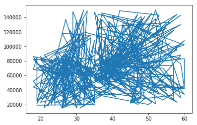

```python
import pandas as pd
import numpy as np
dataset = pd.read_csv("Social_Network_Ads.csv")
```


```python
y = pd.DataFrame(dataset.Purchased)
```


```python
X = pd.DataFrame(dataset.iloc[:,[2,3]])
```


```python
from sklearn.model_selection import train_test_split
train_X, test_X, train_y, test_y = train_test_split(X, y, test_size = 1/4, random_state=0)
```


```python
from sklearn.preprocessing import StandardScaler
sc_X = StandardScaler()
train_X = pd.DataFrame(sc_X.fit_transform(train_X))
test_X = sc_X.transform(test_X)
```


```python
train_y=pd.DataFrame(train_y)
from sklearn.linear_model import LogisticRegression
classifier = LogisticRegression(random_state=0)
classifier.fit(train_X, train_y.values.ravel())
```


    LogisticRegression(C=1.0, class_weight=None, dual=False, fit_intercept=True,
              intercept_scaling=1, max_iter=100, multi_class='ovr', n_jobs=1,
              penalty='l2', random_state=0, solver='liblinear', tol=0.0001,
              verbose=0, warm_start=False)


```python
preds = classifier.predict(test_X)
```


```python
from sklearn.metrics import confusion_matrix
cmat = confusion_matrix(test_y, preds)
```


```python
cmat
```


    array([[65,  3],
           [ 8, 24]])


```python
import matplotlib.pyplot as plt
plt.plot(dataset.Age, dataset.EstimatedSalary)
```


    [<matplotlib.lines.Line2D at 0x7f1205c46940>]





```python
dataset.head()
```


<div>
<style scoped>
    .dataframe tbody tr th:only-of-type {
        vertical-align: middle;
    }

    .dataframe tbody tr th {
        vertical-align: top;
    }

    .dataframe thead th {
        text-align: right;
    }
</style>
<table border="1" class="dataframe">
  <thead>
    <tr style="text-align: right;">
      <th></th>
      <th>User ID</th>
      <th>Gender</th>
      <th>Age</th>
      <th>EstimatedSalary</th>
      <th>Purchased</th>
    </tr>
  </thead>
  <tbody>
    <tr>
      <th>0</th>
      <td>15624510</td>
      <td>Male</td>
      <td>19</td>
      <td>19000</td>
      <td>0</td>
    </tr>
    <tr>
      <th>1</th>
      <td>15810944</td>
      <td>Male</td>
      <td>35</td>
      <td>20000</td>
      <td>0</td>
    </tr>
    <tr>
      <th>2</th>
      <td>15668575</td>
      <td>Female</td>
      <td>26</td>
      <td>43000</td>
      <td>0</td>
    </tr>
    <tr>
      <th>3</th>
      <td>15603246</td>
      <td>Female</td>
      <td>27</td>
      <td>57000</td>
      <td>0</td>
    </tr>
    <tr>
      <th>4</th>
      <td>15804002</td>
      <td>Male</td>
      <td>19</td>
      <td>76000</td>
      <td>0</td>
    </tr>
  </tbody>
</table>
</div>


```python

```
